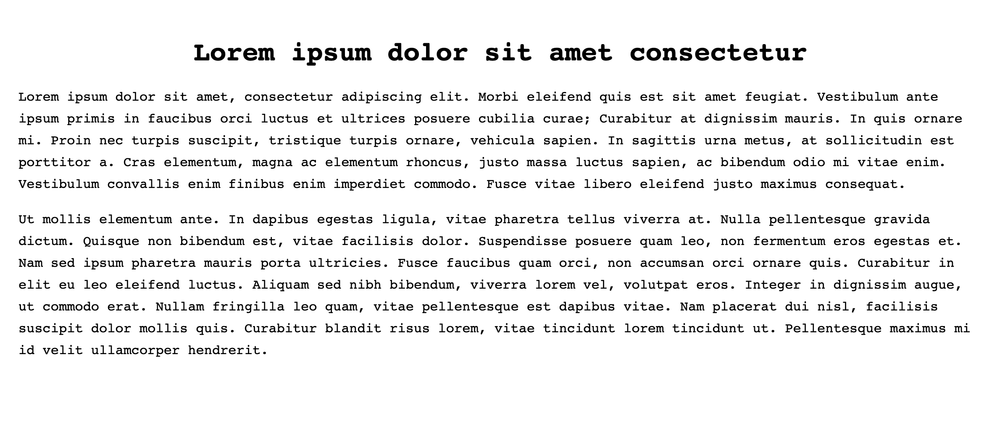

## Using Custom Fonts

1. Make a new folder for your website and a subdirectory for your font files:
2. Download the custom fonts into the font folder you've created. This example uses the [Cantique typeface](https://gitlab.com/velvetyne/cantique).
3. In your `styles.css` file, add the following content, which will define the `@font-face` rule with paths to your files:

```css
@font-face {
  font-family: 'cantiquenormal';
  src: url('../web/cantique-normal-webfont.woff2') format('woff2'),
       url('../web/cantique-normal-webfont.woff') format('woff');
  font-weight: normal;
  font-style: normal;
}
```

4. Now, apply the custom font to the body of the website:

```css
body {
  font-family: 'cantiquenormal', monospace;
}
```



## Resources

* [Using @font-face](https://css-tricks.com/snippets/css/using-font-face/), CSS Tricks. Chris Coyier on Aug 10, 2009.
* [@font-face](https://developer.mozilla.org/en-US/docs/Web/CSS/@font-face), MDN Documentation